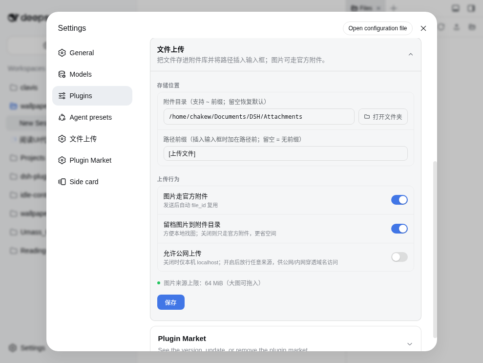

# dsh-file-upload ⬆️

[English](README.md) | [简体中文](README.zh-CN.md)


[](https://awesome-dsh-plugin.com)

**统一上传按钮 + 拖拽文件直进对话** —— DeepSeek Harness（dsh）web 插件。

*非官方项目：社区成员独立开发维护，非 DeepSeek 官方产品。*

> ## ⚠️ 已停止维护（2026-09-10）
>
> **dsh 0.1.5-rc.1 起官方内置了覆盖本插件核心能力的附件系统**（任意类型文件上传；模型按保存的只读路径按需读取）。本插件**不再维护**。
>
> - **最高支持 DSH 版本：0.1.2**（最后验证于 0.1.2-rc.1），不再做修复与兼容。
> - **升级到 dsh 0.1.5 或更新版本前，必须先停用/移除本插件**——与 0.1.5 的附件系统同时存在会导致启动失败（web 起不来）。升级前请从 profile 的 `package.json` 的 `dsh.profile.bundles` 里移除 `dsh-file-upload`。
> - 感谢使用。文件附件请改用官方能力（拖拽或粘贴文件进输入框）。

## 截图


输入框工具行里的上传图标按钮（官方 dsw 风格，跟随深浅色主题）；支持的图片进入官方附件条（自动 file_id 复用），其他文件把路径文本插入输入框。

## 功能

| 操作 | 效果 |
|---|---|
| 点上传图标 | 系统文件选择器（可多选）→ 智能分流 → 附件条和/或路径文本 |
| 把文件拖进窗口 | 图片/任意文件都接管（不再弹"不支持"）→ 智能分流 |
| 把文件夹拖进窗口 | 递归读取整个文件夹 → 在附件库中按原结构重建 → 只插文件夹路径一行（不展开内部文件） |
| **图片**（PNG/JPEG/WebP/GIF） | ① 留档到**附件目录**（按天分文件夹）② 进**官方草稿附件条** → 发送后自动 DeepSeek Files API `file_id`（同图复用，7 天过期自动重传） |
| **其他文件** | 存附件库 `files/` 子目录，`<前缀> 路径` 文本进草稿 |
| 模型不支持图片 | 图片降级为"留档 + 路径文本"（绝不发送图片块，不报 400） |

- 文件上限：单文件 **64MB**（DeepSeek Files API 硬限；主程序附件库默认 20MB，见 *大图（20~64MB）*）
- 所有上传统一进**附件库**：图片 `~/Documents/DSH/Attachments/images/<YYYY-MM-DD>/`，其他文件 `.../files/<YYYY-MM-DD>/`（设置里可改根目录）
- 上传中按钮变灰，失败有中文提示

## 设置卡片



- **附件目录**（默认 `~/Documents/DSH/Attachments`，支持 `~` 前缀）—— 只给图片留档用
- **路径前缀**（默认 `[上传文件]`）—— 插入输入框时加在路径前的文本，清空 = 裸路径
- **图片走官方附件**（默认开）—— 关 = 图片走老路径文本逻辑
- **留档图片到附件目录**（默认开）—— 关 = 只走官方附件（省磁盘；官方通道不可用时仍强制留档）
- **允许公网上传**（默认关）—— 关 = 同源校验保持仅放行本机（防 CSRF）；开 = 放行任意来源，供公网/内网穿透域名访问（如 ddnsto）。仅在信任所有能访问到你 DSH 的人时开启。
- **监听剪贴板**（默认「关」，保持官方内建粘贴；可选 关 / 只监听图片 / 全部文件）—— 粘贴接管档位。关 = 官方内建粘贴；只监听图片 = 截图/复制图片时由本插件接管（模型不支持识图也能贴图，自动降级为路径文本）；全部文件 = 粘贴任何文件都接管（落盘附件库 + 路径文本进草稿）。改档无需刷新页面，保存即生效。
- 只读显示：当前图片来源上限（来自宿主配置）

## 大图（20~64MB）

DeepSeek 单图上限 **64 MB**；主程序本地附件库默认 **20 MB**——超过且 ≤64 MB 的图片走"留档 + 路径文本"（模型仍可经 `read_image` 读，上限同源跟随）。

想让大图也走官方附件路径，在 `~/.dsh/profiles/web/cordis.patch.yml` 追加以下配置并重启 `dsh web`：

```yaml
- id: attachment-local
  config:
    maxImageBytes: 67108864   # 20 MiB → 64 MiB（DeepSeek 官方硬限）
```

注意：该行整行替换配置，需要的键都要写明；主程序升级后随版本核对。无论原图多大，模型看到的始终是主程序规范化版本（≤2048px / ≤4 MiB，每张图 ≤384 token）。

## 安装

官方 bundle 一行安装：

```sh
dsh plugin --profile web add "github:a903067276-rgb/dsh-file-upload#main"
```

装完重启 `dsh web`（bundle 层在启动时合成）。需要 pnpm（`dsh plugin` 是 pnpm 转发器）。

手动挂载（兜底）：见 [docs/install.md](docs/install.md) —— 软链到 `~/.dsh/profiles/web/node_modules/` + 在 `~/.dsh/cordis.patch.yml` 里加**单条** entry（双条会让插件 apply 两次、路由重复注册崩溃），然后重启。

## 使用

1. 点上传图标选文件（可多选），或把文件/文件夹拖进窗口任意位置。
2. **图片**（当前模型支持看图时）：留档附件目录 + 进入官方附件条——发送即模型看图（DeepSeek Files API `file_id`，自动复用）。
3. **图片但模型不支持**（或你关了官方路径）：留档到 `images/` 后写入 `<前缀> <绝对路径>` 行——如 `[上传文件] /path/to/Attachments/images/xxx.png`——保留已有草稿。
4. **其他文件**：存附件库 `files/`，路径文本进草稿；发送后模型按路径读取。
5. **文件夹**：拖入后在附件库按原结构重建，只把文件夹路径（一行）写进草稿。

## 平台支持

| 平台 | 状态 |
|---|---|
| macOS | ✅ 完整测试（开发环境） |
| Linux | ✅ 预期可用（纯 Node 实现），未测 |
| Windows | ⚠️ 预期可用（纯 Node 实现、Windows 安全文件名清洗、平台分隔符路径），未测 |

## 依赖要求

- DSH web >= 0.1.0-rc.7（`dsh web` 运行）
- **版本对照**（尽力兼容——已在本地 0.1.2-alpha.2 / 0.1.2-rc.1 与 0.1.1-rc.2 实测；0.1.0-rc.7/rc.8 上的官方附件条无法完整验证，**不保证**）：
- **维护策略：已停止维护（2026-09-10）**——被 dsh 0.1.5-rc.1 起官方内置的附件系统取代。**最高支持 DSH 版本：0.1.2**，不再更新。

| 你的 DSH 版本 | 装这个 | 说明 |
|---|---|---|
| **0.1.5 及更新** | ⛔ **不要安装** | 已被官方附件系统取代；本插件会导致启动失败——**升级前必须停用/移除** |
| 0.1.1-rc.1 – 0.1.2 | `main`（v0.1.5+） | 最后支持的版本范围（全功能，含官方附件条） |
| 0.1.0-rc.7 – 0.1.0-rc.8 | `main`（v0.1.5+） | 正常；官方附件条自动降级为路径文本（除非会话模型收图）。保守回退：`v0.1.4` — `dsh plugin add github:a903067276-rgb/dsh-file-upload#v0.1.4` |
| 0.1.0-rc.6 及更早 | `v0.1.2` — `dsh plugin add github:a903067276-rgb/dsh-file-upload#v0.1.2` | 最后一个无设置卡片的版本（设置卡片用 rc.7+ keyed slot 契约） |

- 无需额外 shell：host 半纯 Node（`node:fs`），任何平台不依赖系统命令。

## 工作原理

- **Host**（`lib/index.js`）：`POST /api/file-upload/save`——校验会话与大小，用**纯 Node** 写 base64 到 `<附件库>/images/<YYYY-MM-DD>/`（`mode=image`）或 `<附件库>/files/<YYYY-MM-DD>/`（`mode=file`）；`POST /api/file-upload/save-folder`——接收相对路径 + base64 列表，在附件库 `files/<日期>/<时间戳>-<文件夹名>/` 下按原结构重建（逐段 sanitize + 拒绝 `..` 防目录穿越）；`GET/POST /api/file-upload/config`——读写设置（官方 settings 服务）+ 暴露宿主图片上限 + 当前会话模型是否收图——取自与官方 UI 同源的模型路由（模型选择投影 → 会话请求头 → `agentDefaultModel`，旧版 DSH 回退旧契约 `apiProxy.sessions.models`）。
- **Client**（`lib/client.js`）：上传图标挂 `conversation.input.left`；捕获阶段接管拖拽，`webkitGetAsEntry` 递归读入文件夹目录树；分流规则：支持图片 + 开关开 + 模型收图 + 不超宿主上限 → 留档 + `conversation.createDraftImages` + `inputActions.addImages`（官方 InputBar 同款机制）→ 官方附件条（不写路径文本）；其余降级"留档 + 路径文本"；>64MB 拒绝并提示。
- **错误边界**：渲染崩溃降级为"⚠ 上传组件异常"小图标，不卸载整个输入框。

## 备注

- 附件库只增不减，**从不自动清理**（我们不删你的文件）——需要时手动清理。
- 改插件后重启 `dsh web` 生效（client 改动刷新页面即生效；host 改动需重启）。

## 为什么有这个插件

DSH 原生在模型不支持图片时会直接拒绝拖入的图片。本插件在模型能看图时把图片走**官方附件路径**（搭 DeepSeek Files API 的 `file_id` 快车），同时留一份**你能自己找到的附件目录**副本，其余情况降级为纯**路径文本**——纯文本消息能过模型的图片检查，任何模型/视觉插件都能用（降级路径上从不提交图片块，绕开 DSH 原生拒绝）。

## License

[MIT](LICENSE)
